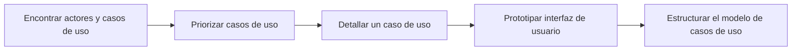

# 03. Flujo de Trabajo: Captura de Requisitos

> Capítulos 6 y 7 del libro: _Captura de Requisitos: de la Visión a los Requisitos_ y _Captura de Requisitos como Casos de Uso_.

## 1. Propósito

Llegar a un acuerdo con el cliente sobre **qué debe hacer el sistema**. El resultado son dos modelos relacionados:

- **Modelo del negocio / dominio** (contexto)
- **Modelo de casos de uso** (requisitos funcionales)

Y un conjunto de **requisitos no funcionales** asociados a cada caso de uso o al sistema completo.

## 2. Trabajadores

| Trabajador                           | Responsabilidad                                                                                    |
| ------------------------------------ | -------------------------------------------------------------------------------------------------- |
| **Analista del sistema**             | Líder del flujo. Captura requisitos, delimita actores y casos de uso, mantiene el modelo coherente |
| **Especificador de casos de uso**    | Escribe la descripción detallada de cada caso de uso                                               |
| **Diseñador de interfaz de usuario** | Da forma a la interacción con el usuario (prototipos, esbozos)                                     |
| **Arquitecto**                       | Selecciona los casos de uso significativos arquitectónicamente                                     |

## 3. Artefactos producidos

| Artefacto                                       | Descripción                         |
| ----------------------------------------------- | ----------------------------------- |
| **Modelo del negocio** o **modelo del dominio** | Describe el contexto del sistema    |
| **Modelo de casos de uso**                      | Actores + casos de uso + relaciones |
| **Especificaciones suplementarias**             | Requisitos no funcionales globales  |
| **Glosario**                                    | Términos del dominio                |
| **Prototipos de interfaz de usuario**           | Bosquejos de pantallas clave        |

## 4. Actividades del flujo



### 4.1. Encontrar actores y casos de uso

**Pasos**:

1. Identificar los **actores**: todo lo externo (usuarios, otros sistemas, hardware) que interactúa con el sistema.
2. Para cada actor, identificar las **metas** que persigue al usar el sistema.
3. Cada meta concreta del actor se convierte en un caso de uso candidato.
4. Nombrar cada caso de uso con un **verbo en infinitivo + objeto** (ej. _Sacar dinero_, _Registrar pedido_).

**Heurísticas**:

- Un actor es un **rol**, no una persona específica. Una persona puede ser varios actores.
- Si dos "actores" hacen exactamente lo mismo, son el mismo actor.
- Un caso de uso completa una **transacción de valor** para el actor.

### 4.2. Priorizar casos de uso

Se priorizan según:

- **Criticidad arquitectónica** (los que ejercitan partes nuevas/riesgosas).
- **Valor de negocio**.
- **Riesgo asociado**.

Los **casos de uso clave** (5–10%) son los que el arquitecto usará en Elaboración.

### 4.3. Detallar un caso de uso

Cada caso de uso tiene una **descripción textual** estructurada:

```
Caso de uso: <nombre>
Actor principal: <quién lo inicia>
Precondiciones: <qué debe ser cierto antes>
Postcondiciones: <qué será cierto después>

Flujo principal (escenario de éxito):
  1. El actor ...
  2. El sistema ...
  3. ...

Flujos alternativos:
  3a. Si <condición> entonces ...

Excepciones:
  E1. Si <error> entonces ...

Requisitos especiales:
  - Tiempo de respuesta < 2s
  - ...
```

### 4.4. Prototipar interfaz de usuario

Para casos de uso clave, se construye un **prototipo de baja fidelidad** (mockups) que ayuda a validar el flujo con el cliente.

### 4.5. Estructurar el modelo

Aplicar las **relaciones** UML:

| Relación           | Cuándo usar                                                                                               |
| ------------------ | --------------------------------------------------------------------------------------------------------- |
| **«include»**      | Un caso de uso incluye siempre el comportamiento de otro (ej. _Sacar dinero_ «include» _Validar usuario_) |
| **«extend»**       | Un caso de uso extiende opcionalmente a otro (ej. _Solicitar préstamo_ «extend» _Sacar dinero_)           |
| **Generalización** | Un caso de uso es variante de otro (raro; usar con cuidado)                                               |

Y agrupar en **paquetes** según afinidad funcional o por actor.

## 5. Modelo del negocio / dominio

### 5.1. Cuándo usar uno u otro

- **Modelo del negocio**: si el sistema apoya procesos de negocio complejos. Se modelan los procesos con **actores del negocio**, **trabajadores del negocio**, **entidades del negocio** y **casos de uso del negocio**.
- **Modelo del dominio**: cuando el sistema es más sencillo. Es un modelo conceptual con las **entidades clave** y sus relaciones.

### 5.2. Para qué sirve

- Vocabulario común con el cliente.
- Punto de partida del modelo de análisis (las clases entidad surgen del dominio).
- Identifica oportunidades de mejora del proceso del negocio.

## 6. Diagramas UML del flujo

| Diagrama                                          | Importancia | Cuándo                                       |
| ------------------------------------------------- | :---------: | -------------------------------------------- |
| **Diagrama de casos de uso**                      |    ★★★★★    | Siempre                                      |
| **Especificación textual de cada caso de uso**    |    ★★★★★    | Siempre                                      |
| **Diagrama de clases del dominio**                |    ★★★★     | Sistemas con dominio rico                    |
| **Diagrama de clases del negocio**                |     ★★★     | Sistemas que automatizan procesos de negocio |
| **Diagrama de actividad** (proceso del negocio)   |    ★★★★     | Para procesos del negocio complejos          |
| **Diagrama de paquetes** (organizar casos de uso) |     ★★★     | Sistemas grandes                             |
| **Mockups / prototipos UI**                       |    ★★★★     | Cuando hay interacción humana                |

## 7. Ejemplo: caso de uso del cajero automático


```
Caso de uso: Sacar dinero
Actor: Cliente del banco

Flujo principal:
  1. El cliente identifica con su tarjeta y PIN.
  2. El sistema valida el PIN con el banco.
  3. El cliente selecciona "Retirar efectivo" e indica el importe.
  4. El sistema verifica el saldo y el límite diario.
  5. El sistema debita la cuenta y entrega el efectivo.
  6. El sistema imprime un recibo.

Flujos alternativos:
  2a. PIN inválido → reintento (máximo 3) → bloqueo.
  4a. Saldo insuficiente → mensaje y volver al menú.
  5a. Sin billetes adecuados → mensaje y abortar la operación.
```

## 8. Errores comunes a evitar

- ❌ Casos de uso de **muy bajo nivel** ("Click en botón Aceptar").
- ❌ Casos de uso que describen **funciones internas** del sistema en vez de objetivos del actor.
- ❌ **Olvidar actores no humanos** (otros sistemas, sensores, schedulers).
- ❌ Usar `«include»`/`«extend»` para **descomponer procedimientos** (no es para eso).
- ❌ Empezar a diseñar **antes de** estabilizar al menos los casos de uso clave.

## Próximo paso

→ [04. Flujo de Análisis](04_Flujo_Analisis.md)
