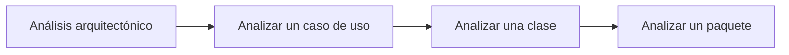
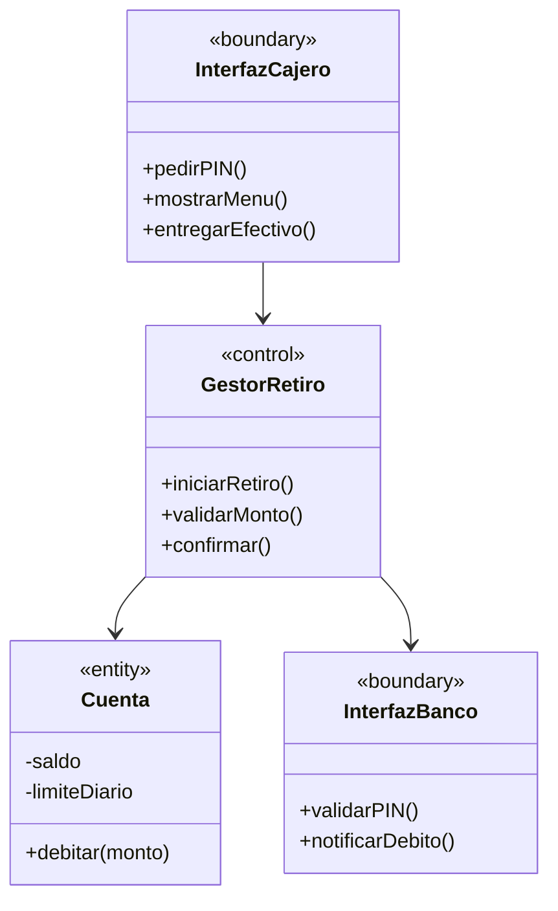

# 04. Flujo de Trabajo: Análisis

> Capítulo 8 del libro: _Análisis_.

## 1. Propósito

Refinar los requisitos de los casos de uso en una **estructura de objetos ideal**, sin preocuparse aún por restricciones de implementación (lenguaje, BD, etc.). El análisis responde _"¿cómo se organiza idealmente el sistema para realizar los casos de uso?"_.

> El modelo de análisis es una **estructura conceptual**: no es lo que se implementa directamente, pero guía el diseño.

## 2. Trabajadores

| Trabajador                    | Responsabilidad                                                         |
| ----------------------------- | ----------------------------------------------------------------------- |
| **Arquitecto**                | Define paquetes y clases de análisis significativos arquitectónicamente |
| **Ingeniero de casos de uso** | Realiza los casos de uso en términos de clases de análisis              |
| **Ingeniero de componentes**  | Mantiene clases de análisis de un paquete                               |

## 3. Artefactos

- **Modelo de análisis** (raíz)
- **Paquetes de análisis** (organización)
- **Clases de análisis** de tres estereotipos
- **Realizaciones de casos de uso – análisis**
- **Vista arquitectónica** del modelo de análisis

## 4. Los tres estereotipos de clase de análisis

UML define tres estereotipos canónicos:

| Estereotipo               | Símbolo | Responsabilidad                                                                                         |
| ------------------------- | ------: | ------------------------------------------------------------------------------------------------------- |
| **«boundary»** (frontera) |      ◯⊢ | Comunicación entre el sistema y los actores (ventanas, formularios, interfaces a otros sistemas)        |
| **«control»** (control)   |      ◯⟲ | Coordina la realización de un caso de uso. Lógica de transacción/negocio que no pertenece a una entidad |
| **«entity»** (entidad)    |       ◯̲ | Información persistente del dominio (Cliente, Cuenta, Pedido)                                           |

**Regla de oro**: cada caso de uso suele tener al menos _una clase de control_, _una clase de frontera por actor_ y _varias clases entidad_.

## 5. Actividades del flujo



### 5.1. Análisis arquitectónico

- Identificar **paquetes de análisis** (verticales por área funcional / horizontales por capa).
- Identificar **clases entidad obvias** del dominio.
- Identificar **requisitos especiales comunes** (seguridad, transacciones, persistencia).

### 5.2. Analizar un caso de uso (realización)

Para cada caso de uso, producir una **realización-análisis**:

1. Identificar las clases que **participan** (frontera, control, entidad).
2. Distribuir el comportamiento del caso de uso entre esas clases (responsabilidades).
3. Documentar la realización con:
   - **Diagrama de clases** participantes.
   - **Diagrama de comunicación** (preferido) o **secuencia** del flujo principal.
   - Texto del flujo de eventos referenciando objetos.

### 5.3. Analizar una clase

Por cada clase de análisis, definir:

- **Responsabilidades** (qué sabe / qué hace).
- **Atributos conceptuales** (no tipos finales).
- **Asociaciones** y multiplicidades.
- **Requisitos especiales** que cumple.

### 5.4. Analizar un paquete

- Coherencia interna (clases relacionadas).
- Mínimas dependencias hacia otros paquetes.
- Define una unidad de trabajo asignable a un equipo.

## 6. Diagramas UML del flujo

| Diagrama                                                    | Importancia | Notas                                              |
| ----------------------------------------------------------- | :---------: | -------------------------------------------------- |
| **Diagrama de clases de análisis** (con estereotipos)       |    ★★★★★    | Imprescindible                                     |
| **Diagrama de comunicación** por realización de caso de uso |    ★★★★★    | Para casos clave                                   |
| **Diagrama de secuencia** (alternativa al anterior)         |    ★★★★     | Cuando el orden temporal es lo importante          |
| **Diagrama de paquetes de análisis**                        |    ★★★★     | Sistemas medianos/grandes                          |
| **Diagrama de objetos**                                     |     ★★      | Solo si hay configuraciones complejas que ilustrar |

## 7. Ejemplo: realización de "Sacar dinero"



**Diagrama de comunicación (esbozo)**:

```
Cliente → :InterfazCajero : 1: insertarTarjeta(t)
:InterfazCajero → :GestorRetiro : 2: iniciarSesion(t)
:GestorRetiro → :InterfazBanco : 3: validarPIN(t, pin)
:GestorRetiro → :Cuenta : 4: verificarSaldo(monto)
:GestorRetiro → :Cuenta : 5: debitar(monto)
:GestorRetiro → :InterfazCajero : 6: entregarEfectivo(monto)
```

## 8. Reglas prácticas

1. **No** tomar decisiones de implementación (lenguaje, framework, BD).
2. Una **clase de análisis ≠ clase de diseño**. Una clase de análisis puede convertirse en varias de diseño (o ninguna).
3. **Cada realización debe estar alineada** con el flujo principal y los flujos alternativos del caso de uso.
4. Si una clase **no participa en ningún caso de uso**, sobra.
5. La **trazabilidad** caso de uso ↔ clases de análisis ↔ realización debe ser explícita.

## 9. Errores comunes

- ❌ Hacer el modelo de análisis **demasiado detallado** (eso es diseño).
- ❌ Saltarse el análisis e ir directo al diseño en proyectos no triviales.
- ❌ Mezclar estereotipos (una entidad que también hace de control).
- ❌ No actualizar el análisis cuando los casos de uso cambian.

## Próximo paso

→ [05. Flujo de Diseño](05_Flujo_Diseno.md)
