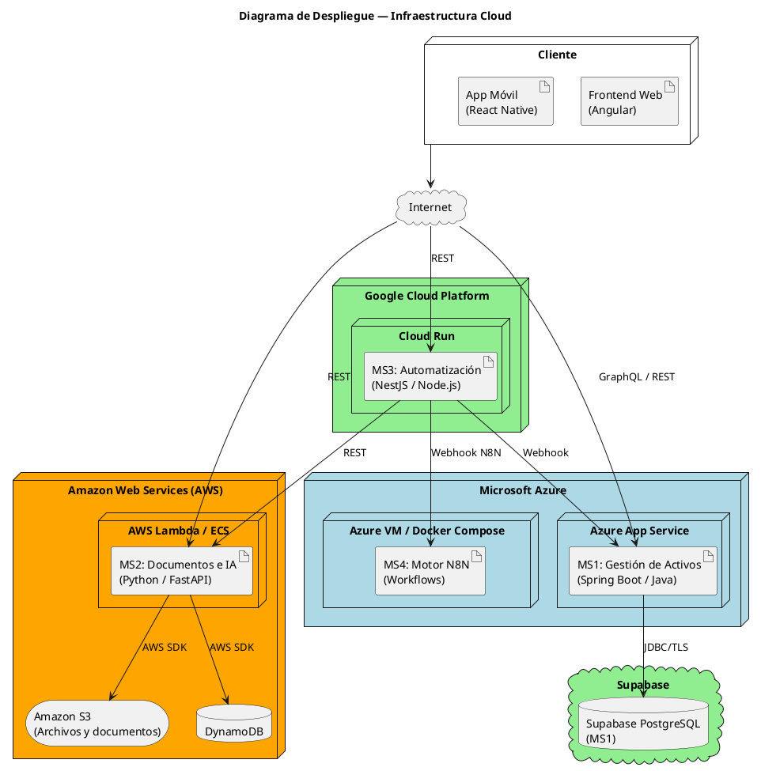
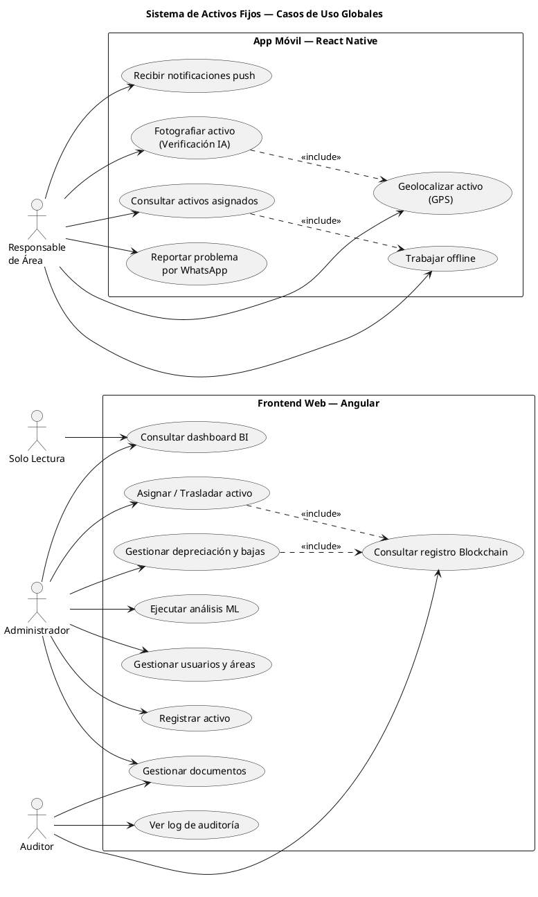
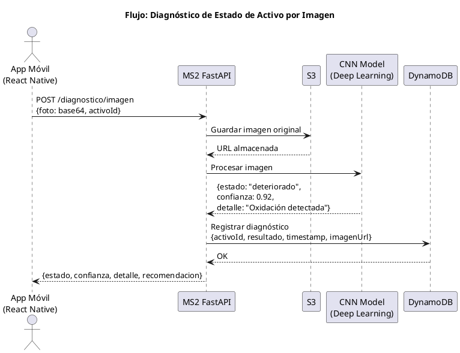
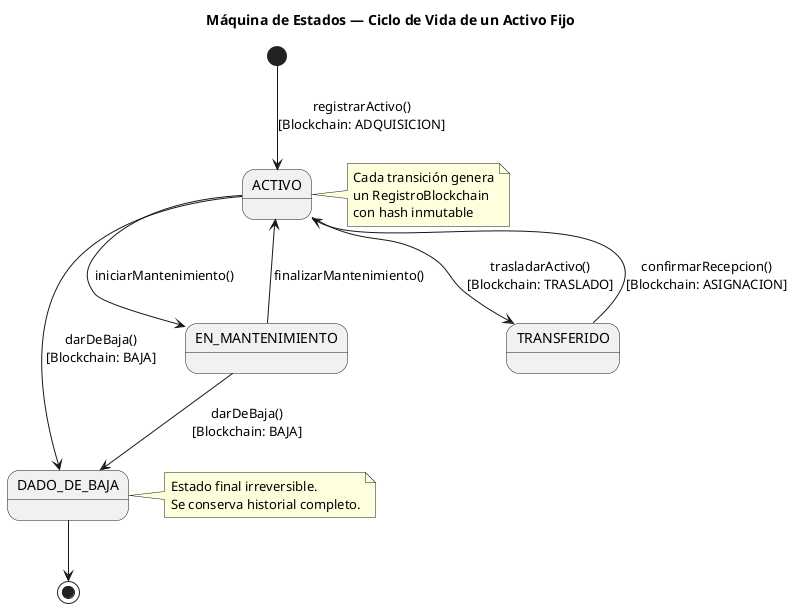
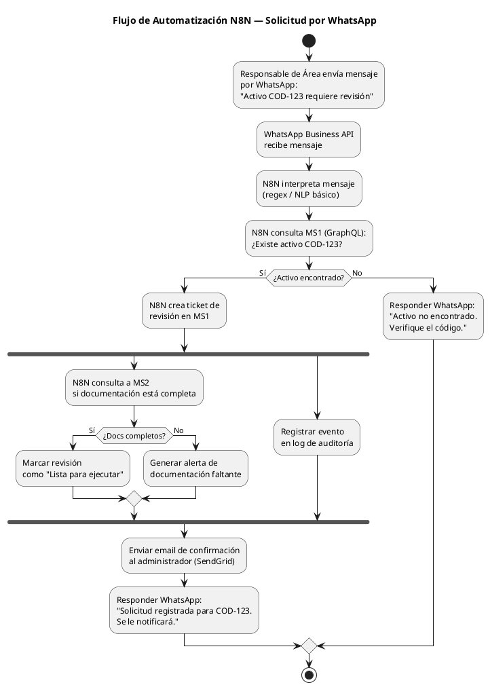

**UNIVERSIDAD AUTÓNOMA GABRIEL RENÉ MORENO**

**_Facultad de Ingeniería en Ciencias de la Computación y Telecomunicaciones_**

---

**Materia :** Ingeniería de Software II

**Docente :** Ing. MARTINEZ CANEDO ROLANDO ANTONIO

**Metodología :** Proceso Unificado

**Semestre :** 1 / 2026

---

Santa Cruz – Bolivia

---

# Sistema de Gestión de Activos Fijos

---

# Contenido

**[1. Descripción General del Sistema](#1-descripción-general-del-sistema)**

**[2. Alcance del Sistema](#2-alcance-del-sistema)**

[2.1 Tecnologías a Utilizar](#21-tecnologías-a-utilizar)

**[3. Actores del Sistema](#3-actores-del-sistema)**

[3.1 Actores Primarios](#31-actores-primarios)

**[4. Microservicios y Distribución Tecnológica](#4-microservicios-y-distribución-tecnológica)**

[4.1 MS1 — Gestión de Activos Fijos](#41-ms1--gestión-de-activos-fijos)

[4.2 MS2 — Gestión Documental e Inteligencia Artificial](#42-ms2--gestión-documental-e-inteligencia-artificial)

[4.3 MS3 — Automatización y Notificaciones](#43-ms3--automatización-y-notificaciones)

[4.4 Almacenamiento de Archivos](#44-almacenamiento-de-archivos)

[4.5 Frontend Web](#45-frontend-web)

[4.6 Aplicación Móvil](#46-aplicación-móvil)

[4.7 Infraestructura y Despliegue](#47-infraestructura-y-despliegue)

**[5. Módulos del Sistema y Casos de Uso](#5-módulos-del-sistema-y-casos-de-uso)**

[MÓDULO 1 — Gestión de Activos](#módulo-1--gestión-de-activos)

[MÓDULO 2 — Gestión de Asignaciones y Traslados](#módulo-2--gestión-de-asignaciones-y-traslados)

[MÓDULO 3 — Gestión de Depreciación y Bajas](#módulo-3--gestión-de-depreciación-y-bajas)

[MÓDULO 4 — Gestión Documental](#módulo-4--gestión-documental)

[MÓDULO 5 — Diagnóstico por IA (App Móvil — Exclusivo para Responsable de Área)](#módulo-5--diagnóstico-por-ia-app-móvil--exclusivo-para-responsable-de-área)

[MÓDULO 6 — Trabajo de Campo (App Móvil — Exclusivo para Responsable de Área)](#módulo-6--trabajo-de-campo-app-móvil--exclusivo-para-responsable-de-área)

[MÓDULO 7 — Gestión de Usuarios y Roles](#módulo-7--gestión-de-usuarios-y-roles)

[MÓDULO 8 — Inteligencia de Negocio](#módulo-8--inteligencia-de-negocio)

[MÓDULO 9 — Análisis Predictivo (Machine Learning)](#módulo-9--análisis-predictivo-machine-learning)

[MÓDULO 10 — Automatización de Procesos](#módulo-10--automatización-de-procesos)

[MÓDULO 11 — Registro Blockchain y Auditoría](#módulo-11--registro-blockchain-y-auditoría)

**[6. Relación de Casos de Uso con Tecnologías Avanzadas](#6-relación-de-casos-de-uso-con-tecnologías-avanzadas)**

[6.1 Deep Learning](#61-deep-learning)

[6.2 Machine Learning](#62-machine-learning)

[6.3 Blockchain](#63-blockchain)

[6.4 Automatización de Procesos — Flujo N8N](#64-automatización-de-procesos--flujo-n8n)

[6.5 Inteligencia de Negocio](#65-inteligencia-de-negocio)

[6.6 Aplicación Móvil — Recursos Nativos del Dispositivo](#66-aplicación-móvil--recursos-nativos-del-dispositivo)

[6.7 Gestión Documental — Módulos con Auditoría](#67-gestión-documental--módulos-con-auditoría)

---

# 1. Descripción General del Sistema

El sistema a desarrollar es una **plataforma distribuida de gestión integral de activos fijos** para una organización. Cubre las áreas operativas, administrativas y de inteligencia de negocio relacionadas con el ciclo de vida completo de los activos: registro, asignación, traslado, depreciación, mantenimiento y baja. Incorpora capacidades avanzadas de **Inteligencia Artificial, Machine Learning, Deep Learning, Blockchain y Automatización de Procesos**.

El sistema se distribuye en **4 microservicios** desplegados en la nube: MS1 en Azure, MS2 en AWS, MS3 como coordinador Node.js y MS4 como motor N8N en Azure. El frontend web único en Angular y la aplicación móvil React Native consumen MS1, MS2 y MS3; MS4 solo es invocado por MS3.

---

# 2. Alcance del Sistema

El sistema abarca las siguientes áreas funcionales y tecnológicas:

- Registro y catalogación de activos fijos con ciclo de vida completo (adquisición → baja)
- Asignación de activos a responsables y áreas, con control de traslados
- Cálculo automático de depreciación por métodos lineal, acelerado y suma de dígitos
- Gestión documental con historial de versiones, auditoría completa y almacenamiento en S3
- Diagnóstico del estado físico de activos mediante Deep Learning aplicado a imágenes
- Análisis predictivo con Machine Learning supervisado (Random Forest) y no supervisado (K-Means)
- Registro inmutable de transacciones de activos mediante Blockchain
- Automatización de flujos con N8N: WhatsApp → sistema → notificación por email
- Business Intelligence con dashboards ejecutivos, KPIs y reportes de depreciación
- Aplicación móvil para inspección de campo con cámara, GPS y modo offline
- Despliegue 100% en la nube con contenedores Docker

### Diagrama de Contexto C4

```plantuml
@startuml C4_Contexto
!include https://raw.githubusercontent.com/plantuml-stdlib/C4-PlantUML/master/C4_Context.puml

LAYOUT_WITH_LEGEND()

title Sistema de Gestión de Activos Fijos — Diagrama de Contexto

Person(admin, "Administrador", "Gestiona activos, reportes y configuración del sistema")
Person(responsable, "Responsable de Área", "Recibe y gestiona activos asignados a su área")
Person(auditor, "Auditor", "Revisa registros, documentos y trazabilidad")

System(saf, "Sistema de Activos Fijos", "Plataforma distribuida para gestión, seguimiento, depreciación y documentación de activos fijos")

System_Ext(email, "Servicio de Email\n(SendGrid)", "Envío de notificaciones y alertas")
System_Ext(whatsapp, "WhatsApp Business API", "Recepción de solicitudes móviles")
System_Ext(blockchain_ext, "Red Blockchain\n(Ethereum / Hyperledger)", "Registro inmutable de transacciones")

Rel(admin, saf, "Administra activos y genera reportes", "Web / Angular")
Rel(responsable, saf, "Consulta y reporta estado de activos", "App Móvil / React Native")
Rel(auditor, saf, "Revisa documentación y auditoría", "Web / Angular")

Rel(saf, email, "Envía notificaciones automáticas")
Rel(saf, whatsapp, "Recibe solicitudes de revisión")
Rel(saf, blockchain_ext, "Registra transacciones de activos")

@enduml
```

## 2.1 Tecnologías a Utilizar

|            **Capa**            |             **Tecnología**             |                    **Rol en el sistema**                     |
| :----------------------------: | :------------------------------------: | :----------------------------------------------------------: |
|        **Backend MS1**         |           Spring Boot (Java)           |          Gestión de Activos Fijos — Microsoft Azure          |
|        **Backend MS2**         |            FastAPI (Python)            |             Gestión Documental e IA — Amazon AWS             |
|        **Backend MS3**         |            NestJS (Node.js)            |        Coordinación de Automatización y Notificaciones       |
|        **Backend MS4**         |                  N8N                   |        Motor de workflows automatizados — Microsoft Azure    |
|        **Frontend Web**        |                Angular                 |        Interfaz única para todos los actores internos        |
|         **App Móvil**          |              React Native              | Trabajo de campo para el Responsable de Área (iOS y Android) |
|  **Base de Datos Relacional**  |          Supabase PostgreSQL            |          MS1 — activos, asignaciones, depreciación           |
|    **Base de Datos NoSQL**     |           DynamoDB (Amazon)            |          MS2 — metadatos de documentos y auditoría           |
| **Almacenamiento de Archivos** |               Amazon S3                |        Documentos PDF, imágenes, contratos, facturas         |
|       **Deep Learning**        |            TensorFlow / CNN            |      Diagnóstico de estado físico de activos por imagen      |
|      **Machine Learning**      |         scikit-learn (Python)          |       Predicción de vida útil y clustering de activos        |
|         **Blockchain**         |        Ethereum Sepolia / Web3j        |        Registro inmutable de transacciones de activos        |
|  **Inteligencia de Negocio**   |        GraphQL + Chart.js / D3         |    Dashboards ejecutivos con KPIs en el frontend Angular     |
|       **Automatización**       | MS4/N8N + WhatsApp Business API + SendGrid |      Flujo automatizado de solicitudes y alertas          |
|        **API Gateway**         |    GraphQL (MS1) / REST (MS2 y MS3)    |        Comunicación entre frontend, móvil y backends         |
|      **Infraestructura**       |                 Docker                 |             Contenedores en Azure, AWS y Google Cloud        |

---

# 3. Actores del Sistema

## 3.1 Actores Primarios

|        **Actor**        | **Descripción**                                                                                                                                                                                                                                     |
| :---------------------: | :-------------------------------------------------------------------------------------------------------------------------------------------------------------------------------------------------------------------------------------------------- |
|    **Administrador**    | Responsable de la gestión integral de activos. Registra, asigna, traslada, deprecia y da de baja activos. Accede a dashboards de BI, reportes de depreciación y configuración del sistema. Interactúa principalmente desde el frontend web Angular. |
| **Responsable de Área** | Personal a cargo de los activos asignados a su área. Realiza inspecciones de campo: fotografía activos, geolocaliza su posición y reporta problemas. Trabaja desde la aplicación móvil React Native con capacidad offline.                          |
|       **Auditor**       | Rol de sólo lectura. Revisa el historial de movimientos, documentos asociados, logs de auditoría y registros Blockchain para verificar la trazabilidad completa de los activos. Accede desde el frontend web Angular.                               |
|    **Solo Lectura**     | Usuario con acceso de consulta. Puede visualizar el catálogo de activos y sus asignaciones, sin capacidad de modificación.                                                                                                                          |

---

# 4. Microservicios y Distribución Tecnológica

### Diagrama de Contenedores C4

```plantuml
@startuml C4_Contenedores
!include https://raw.githubusercontent.com/plantuml-stdlib/C4-PlantUML/master/C4_Container.puml

LAYOUT_WITH_LEGEND()

title Sistema de Activos Fijos — Diagrama de Contenedores

Person(admin, "Administrador / Auditor")
Person(responsable, "Responsable de Área")

System_Boundary(saf, "Sistema de Activos Fijos") {

    Container(frontend, "Frontend Web", "Angular", "Interfaz web única para todos los microservicios")
    Container(mobile, "App Móvil", "React Native", "Acceso móvil con cámara, GPS e IA")

    Container_Boundary(azure_ms, "MS1 — Azure") {
        Container(ms1, "Gestión de Activos", "Spring Boot / Java", "CRUD de activos, depreciación, asignaciones, blockchain, BI")
    }

    Container_Boundary(supabase_ms1, "Supabase") {
        ContainerDb(pg, "Supabase PostgreSQL", "PostgreSQL administrado", "Activos, asignaciones, depreciación")
    }

    Container_Boundary(aws_ms, "MS2 — AWS") {
        Container(ms2, "Documentos e IA", "Python / FastAPI", "Gestión documental, auditoría, ML, Deep Learning")
        ContainerDb(dynamo, "DynamoDB", "Base de datos NoSQL", "Metadatos de documentos y auditoría")
        ContainerDb(s3, "Amazon S3", "Almacenamiento de objetos", "Archivos PDF, imágenes, contratos")
    }

    Container_Boundary(gcp_ms, "MS3 — Google Cloud") {
        Container(ms3, "Automatización", "NestJS / Node.js", "Coordinación de flujos automatizados y notificaciones")
    }

    Container_Boundary(azure_ms4, "MS4 — Azure") {
        Container(ms4, "Motor N8N", "N8N", "Ejecución de workflows automatizados")
    }
}

System_Ext(email, "SendGrid")
System_Ext(whatsapp, "WhatsApp API")
System_Ext(blockchain_ext, "Red Blockchain")

Rel(admin, frontend, "Usa", "HTTPS")
Rel(responsable, mobile, "Usa", "HTTPS")

Rel(frontend, ms1, "Consultas y mutaciones", "GraphQL / HTTPS")
Rel(frontend, ms2, "Gestión documental", "REST / HTTPS")
Rel(frontend, ms3, "Consulta estado de flujos", "REST / HTTPS")

Rel(mobile, ms1, "Consulta activos asignados", "REST / HTTPS")
Rel(mobile, ms2, "Sube foto, recibe verificación IA", "REST / HTTPS")

Rel(ms1, pg, "Lee y escribe", "JDBC")
Rel(ms1, blockchain_ext, "Registra transacciones", "Web3j")
Rel(ms2, dynamo, "Lee y escribe metadatos", "AWS SDK")
Rel(ms2, s3, "Almacena archivos", "AWS SDK")
Rel(ms3, ms1, "Detecta eventos de activos", "Webhook")
Rel(ms3, ms2, "Verifica documentación", "REST")
Rel(ms3, ms4, "Dispara workflows", "Webhook N8N")
Rel(ms3, email, "Envía notificaciones")
Rel(ms3, whatsapp, "Recibe solicitudes")

@enduml
```

## 4.1 MS1 — Gestión de Activos Fijos

- **Framework Backend:** Spring Boot (Java)
- **Base de Datos:** Supabase PostgreSQL (relacional)
- **Proveedor Cloud:** Microsoft Azure para la aplicación (Azure App Service) + Supabase para PostgreSQL administrado
- **Responsabilidades:** Registro y catalogación de activos fijos, asignación a responsables y áreas, control de traslados, cálculo de depreciación (lineal, acelerado, suma de dígitos), gestión de bajas, registro Blockchain de cada transacción, endpoints de Business Intelligence para el dashboard Angular. Toda la comunicación con el frontend Angular se realiza mediante **GraphQL**.

## 4.2 MS2 — Gestión Documental e Inteligencia Artificial

- **Framework Backend:** FastAPI (Python)
- **Base de Datos:** DynamoDB (NoSQL) + Amazon S3
- **Proveedor Cloud:** Amazon Web Services (AWS Lambda / ECS)
- **Responsabilidades:** Subida y descarga de documentos (PDF, imágenes, contratos), historial de versiones, auditoría completa de accesos y modificaciones en DynamoDB, diagnóstico del estado físico de activos por imagen (CNN — Deep Learning), predicción de vida útil restante (Random Forest — ML Supervisado), agrupación de activos por comportamiento (K-Means — ML No Supervisado).

## 4.3 MS3 — Automatización y Notificaciones

- **Framework Backend:** NestJS (Node.js)
- **Proveedor Cloud:** Google Cloud Platform (Cloud Run)
- **Responsabilidades:** Recepción de solicitudes vía WhatsApp Business API, exposición de webhooks para MS1/MS2, coordinación de flujos automatizados, generación automática de órdenes de revisión y mantenimiento, envío de notificaciones por correo electrónico (SendGrid), alertas por vencimiento de garantías o mantenimientos programados. Cuando el flujo requiere N8N, MS3 invoca MS4.

## 4.4 MS4 — Motor N8N

- **Herramienta:** N8N self-hosted
- **Proveedor Cloud:** Microsoft Azure
- **Responsabilidades:** Ejecutar los workflows N8N exportados, conservar credenciales y ejecuciones de N8N en volumen persistente, y exponer webhooks consumidos exclusivamente por MS3.
- **CI/CD:** Pipeline propio en `.github/workflows/ms4-azure-cd.yml`.

## 4.5 Almacenamiento de Archivos

- **Servicio:** Amazon S3
- **Uso:** Documentos PDF de compra y garantía, fotografías de estado inicial y diagnóstico, informes de mantenimiento, actas de baja, contratos y reportes exportados.

## 4.6 Frontend Web

- **Framework:** Angular
- **Interacción con backends:** GraphQL hacia MS1 (gestión de activos y BI); REST hacia MS2 (documentos, IA) y MS3 (flujos, notificaciones). No consume MS4 directamente.

## 4.7 Aplicación Móvil

- **Framework:** React Native
- **Público objetivo:** Responsable de Área (personal de campo)
- **Funcionalidades Clave:** Consulta de activos asignados al área, fotografía de activos con verificación IA en tiempo real, geolocalización de activos mediante GPS, reporte de problemas o solicitud de revisión, trabajo offline con caché local de activos, recepción de notificaciones push.

## 4.8 Infraestructura y Despliegue

- **Contenedores:** Docker (todos los servicios)
- **Proveedores:** Microsoft Azure (MS1 App Service y MS4/N8N) — Supabase (PostgreSQL MS1) — Amazon Web Services (MS2) — Google Cloud Platform (MS3)

### Diagrama de Despliegue



---

# 5. Módulos del Sistema y Casos de Uso



## MÓDULO 1 — Gestión de Activos

**Objetivo:** Administrar el ciclo de vida completo de los activos fijos de la organización, desde su adquisición hasta la baja definitiva. Es el núcleo operativo del sistema; todas las demás entidades del sistema se relacionan con el activo.

**Funciones principales:** _Registrar activo, editar datos, consultar catálogo, buscar por criterios, cambiar estado, generar código de activo, clasificar por categoría._

- CU-01: Registrar nuevo activo fijo
- CU-02: Editar datos del activo
- CU-03: Consultar catálogo de activos
- CU-04: Buscar activo por código, nombre o categoría
- CU-05: Cambiar estado del activo (ACTIVO / EN_MANTENIMIENTO / TRANSFERIDO / DADO_DE_BAJA)
- CU-06: Registrar categoría de activo con método de depreciación
- CU-07: Editar categoría de activo
- CU-08: Consultar historial completo de movimientos del activo
- CU-09: Ver ficha detallada del activo con valor en libros actual

## MÓDULO 2 — Gestión de Asignaciones y Traslados

**Objetivo:** Controlar la asignación de activos a responsables y áreas, y gestionar los movimientos físicos entre áreas. Cada operación genera un registro Blockchain para garantizar trazabilidad e inalterabilidad.

**Funciones principales:** _Asignar activo, registrar traslado, devolver activo, consultar activos por área, autorizar traslado._

- CU-10: Asignar activo a responsable de área
- CU-11: Devolver activo al inventario general
- CU-12: Registrar traslado de activo entre áreas
- CU-13: Autorizar traslado (requiere rol Administrador)
- CU-14: Consultar activos asignados por área
- CU-15: Consultar historial de asignaciones de un activo
- CU-16: Consultar historial de traslados de un activo
- CU-17: Generar reporte de activos por responsable

## MÓDULO 3 — Gestión de Depreciación y Bajas

**Objetivo:** Calcular y registrar la depreciación de activos fijos según el método configurado en su categoría. Gestionar el retiro definitivo de activos con registro de valor residual y motivo de baja.

**Funciones principales:** _Calcular depreciación, generar reporte anual, registrar baja de activo, consultar valor en libros, proyectar vida útil restante._

- CU-18: Calcular depreciación de activo (lineal / acelerado / suma de dígitos)
- CU-19: Generar reporte de depreciación anual por categoría
- CU-20: Consultar valor en libros actual de un activo
- CU-21: Proyectar vida útil restante de un activo
- CU-22: Registrar baja de activo (con motivo y valor residual)
- CU-23: Autorizar baja de activo (requiere rol Administrador)
- CU-24: Consultar historial de activos dados de baja en un período
- CU-25: Generar acta de baja en PDF

## MÓDULO 4 — Gestión Documental

**Objetivo:** Centralizar el almacenamiento, acceso y versionamiento de todos los documentos asociados a cada activo fijo. Registra auditoría completa en DynamoDB de quién accedió, modificó o descargó cada documento.

**Funciones principales:** _Cargar documento, descargar documento, gestionar versiones, visualizar historial de auditoría, eliminar documento._

- CU-26: Cargar documento asociado a un activo (PDF, imagen, contrato)
- CU-27: Descargar documento desde Amazon S3
- CU-28: Actualizar versión de un documento existente
- CU-29: Consultar historial de versiones de un documento
- CU-30: Eliminar documento (con registro en auditoría)
- CU-31: Consultar log de auditoría de un documento (accesos, modificaciones)
- CU-32: Buscar documentos por tipo, activo o fecha
- CU-33: Listar todos los documentos de un activo

## MÓDULO 5 — Diagnóstico por IA (App Móvil — Exclusivo para Responsable de Área)

**Objetivo:** Permitir al Responsable de Área fotografiar un activo en campo y recibir en tiempo real un diagnóstico automático del estado físico generado por el modelo de Deep Learning (CNN) del MS2. El diagnóstico es registrado en el historial del activo.

**Funciones principales:** _Activar cámara, capturar fotografía, enviar al modelo CNN, recibir diagnóstico con nivel de confianza, guardar resultado en historial del activo._

- CU-34: Fotografiar activo con la cámara del dispositivo
- CU-35: Enviar imagen al MS2 para diagnóstico por CNN
- CU-36: Recibir diagnóstico: estado (Bueno / Deteriorado / Requiere mantenimiento), confianza y detalle
- CU-37: Guardar imagen y diagnóstico en el historial del activo
- CU-38: Consultar historial de verificaciones anteriores del activo
- CU-39: Solicitar orden de mantenimiento desde el resultado del diagnóstico

## MÓDULO 6 — Trabajo de Campo (App Móvil — Exclusivo para Responsable de Área)

**Objetivo:** Dar al Responsable de Área las herramientas necesarias para gestionar sus activos desde el terreno. Incluye geolocalización, trabajo sin conexión y recepción de alertas en tiempo real.

**Funciones principales:** _Consultar activos asignados, geolocalizar activo, trabajar offline, reportar problema por WhatsApp, recibir notificaciones push._

- CU-40: Consultar activos asignados al área (con modo offline)
- CU-41: Ver detalle de activo en campo
- CU-42: Geolocalizar activo y registrar coordenadas GPS
- CU-43: Reportar problema o solicitar revisión (integrado con WhatsApp)
- CU-44: Recibir notificación push de alertas de mantenimiento
- CU-45: Sincronizar datos offline al recuperar conexión

## MÓDULO 7 — Gestión de Usuarios y Roles

**Objetivo:** Administrar el ciclo de vida de los usuarios del sistema: Administrador, Responsable de Área, Auditor y Solo Lectura. Garantiza el control de acceso y la integridad del sistema.

**Funciones principales:** _Crear usuario, editar datos, asignar rol, inactivar usuario, restablecer contraseña, buscar por criterios._

- CU-46: Registrar nuevo usuario
- CU-47: Editar datos personales del usuario
- CU-48: Asignar o cambiar rol del usuario
- CU-49: Inactivar o dar de baja a un usuario
- CU-50: Restablecer contraseña
- CU-51: Registrar área organizacional
- CU-52: Asignar responsable principal a un área
- CU-53: Buscar usuario por nombre, email o rol

## MÓDULO 8 — Inteligencia de Negocio

**Objetivo:** Proveer a administradores y auditores una visión clara del estado y desempeño del inventario de activos mediante dashboards interactivos con KPIs. Los datos se exponen a través del endpoint GraphQL `dashboardBI` del MS1 y se visualizan en el frontend Angular.

**Funciones principales:** _Visualizar dashboard ejecutivo, consultar KPIs por período, analizar depreciación, exportar reporte, consultar proyección de vida útil._

- CU-54: Visualizar dashboard ejecutivo con KPIs
- CU-55: Consultar total de activos y valor total en libros
- CU-56: Analizar depreciación acumulada por categoría y área
- CU-57: Ver distribución de activos por estado
- CU-58: Consultar tendencia de adquisiciones por año
- CU-59: Ver proyección de vida útil de activos críticos
- CU-60: Exportar reporte de BI en PDF

## MÓDULO 9 — Análisis Predictivo (Machine Learning)

**Objetivo:** Aplicar modelos de Machine Learning supervisado y no supervisado sobre los datos del sistema para generar predicciones de vida útil y agrupar activos por patrones de comportamiento.

**Funciones principales:** _Generar predicción de vida útil, clasificar riesgo de fallo, agrupar activos por clustering, consultar resultado de predicción._

- CU-61: Generar predicción de vida útil restante de un activo (Random Forest — regresión)
- CU-62: Estimar probabilidad de fallo próximo de un activo (Random Forest — clasificación)
- CU-63: Agrupar activos por patrones de comportamiento (K-Means — no supervisado)
- CU-64: Consultar resultado de predicción en la ficha del activo
- CU-65: Recibir recomendación de mantenimiento preventivo basada en predicción
- CU-66: Visualizar grupos de clustering con etiqueta de comportamiento (Alto riesgo / Normal / Eficiente)

## MÓDULO 10 — Automatización de Procesos

**Objetivo:** Orquestar flujos automatizados de mínimo 3 pasos que conectan los microservicios del sistema con canales externos (WhatsApp, Email) sin intervención manual. MS3 coordina los eventos y MS4 ejecuta N8N en Azure.

**Funciones principales:** _Recibir solicitud por WhatsApp, identificar activo, crear ticket de revisión, verificar documentación, enviar confirmación por email, enviar alertas automáticas._

- CU-67: Recibir mensaje de WhatsApp del responsable de área
- CU-68: Identificar activo por código en el mensaje (MS4/N8N + MS1)
- CU-69: Crear ticket de revisión en MS1 (REST desde MS4/N8N)
- CU-70: Verificar documentación del activo en MS2 (REST desde MS4/N8N)
- CU-71: Enviar email de confirmación de solicitud (SendGrid)
- CU-72: Responder por WhatsApp con estado de la solicitud
- CU-73: Enviar alerta automática por vencimiento de garantía
- CU-74: Enviar alerta de mantenimiento programado

## MÓDULO 11 — Registro Blockchain y Auditoría

**Objetivo:** Garantizar la trazabilidad completa e inalterabilidad de cada transacción crítica del ciclo de vida de los activos mediante el registro en una red Blockchain. Cada cambio de estado del activo genera un hash inmutable verificable externamente.

**Funciones principales:** _Registrar transacción en Blockchain, consultar hash de transacción, verificar integridad de registro, consultar historial Blockchain de un activo._

- CU-75: Registrar adquisición de activo en Blockchain
- CU-76: Registrar asignación de activo en Blockchain
- CU-77: Registrar traslado de activo en Blockchain
- CU-78: Registrar baja de activo en Blockchain
- CU-79: Registrar diagnóstico crítico de IA en Blockchain
- CU-80: Consultar historial Blockchain de un activo (hash + bloque + timestamp)
- CU-81: Verificar integridad de registro Blockchain externamente

---

# 6. Relación de Casos de Uso con Tecnologías Avanzadas

## 6.1 Deep Learning

|                            **Aplicación**                             |  **Casos de Uso**   |     **Microservicio**     |                 **Herramienta**                  |
| :-------------------------------------------------------------------: | :-----------------: | :-----------------------: | :----------------------------------------------: |
|          Diagnóstico del estado físico de activos por imagen          | CU-35, CU-36, CU-37 | MS2 (FastAPI) + App Móvil |             CNN (TensorFlow / Keras)             |
| Clasificación de estado: Bueno / Deteriorado / Requiere mantenimiento |        CU-36        |       MS2 (FastAPI)       | CNN — modelo entrenado sobre imágenes de activos |
|             Registro de diagnóstico crítico en Blockchain             |        CU-79        |     MS1 (Spring Boot)     |         Resultado CNN → hash Blockchain          |

### Flujo de Diagnóstico por Imagen



## 6.2 Machine Learning

|          **Tipo**           |                    **Aplicación**                    |                  **Variables de entrada**                   |  **Casos de Uso**   | **Microservicio** |
| :-------------------------: | :--------------------------------------------------: | :---------------------------------------------------------: | :-----------------: | :---------------: |
|   Supervisado — Regresión   |     Predicción de vida útil restante del activo      | Edad, N° mantenimientos, categoría, diagnósticos históricos | CU-61, CU-64, CU-65 |   MS2 (FastAPI)   |
| Supervisado — Clasificación |            Probabilidad de fallo próximo             |              Edad, estado, uso, mantenimientos              |    CU-62, CU-64     |   MS2 (FastAPI)   |
| No Supervisado — Clustering | Agrupación de activos por patrones de comportamiento |  Frecuencia de mantenimiento, vida útil, estado, categoría  |    CU-63, CU-66     |   MS2 (FastAPI)   |

## 6.3 Blockchain

|             **Aplicación**             | **Casos de Uso** | **Microservicio** |            **Herramienta**             |
| :------------------------------------: | :--------------: | :---------------: | :------------------------------------: |
|   Registro de adquisición de activo    |      CU-75       | MS1 (Spring Boot) | Ethereum Sepolia / Web3j / Hyperledger |
|    Registro de asignación de activo    |      CU-76       | MS1 (Spring Boot) |        Ethereum Sepolia / Web3j        |
|     Registro de traslado de activo     |      CU-77       | MS1 (Spring Boot) |        Ethereum Sepolia / Web3j        |
|       Registro de baja de activo       |      CU-78       | MS1 (Spring Boot) |        Ethereum Sepolia / Web3j        |
| Registro de diagnóstico crítico por IA |      CU-79       | MS1 (Spring Boot) |        Ethereum Sepolia / Web3j        |

### Diagrama de Estados — Ciclo de Vida del Activo



## 6.4 Automatización de Procesos — Flujo N8N

|                     **Acción**                      | **Caso de Uso** |            **Herramienta**             |
| :-------------------------------------------------: | :-------------: | :------------------------------------: |
|   El responsable contacta al sistema por WhatsApp   |      CU-67      |      WhatsApp Business API + MS3       |
|  MS4/N8N identifica el activo por código en el mensaje |   CU-68      | MS4/N8N (regex / NLP básico) + MS1 GraphQL |
|         MS4/N8N crea ticket de revisión en MS1      |      CU-69      |        MS4/N8N + MS1 REST / GraphQL    |
|    MS4/N8N verifica documentación del activo en MS2 |      CU-70      |             MS4/N8N + MS2 REST         |
| El sistema envía confirmación por email (SendGrid)  |      CU-71      |           MS4/N8N + SendGrid API       |
|     El sistema responde al WhatsApp con estado      |      CU-72      |      MS3 + WhatsApp Business API       |
| MS4/N8N procesa vencimiento de garantía y genera alerta |  CU-73    |       MS4/N8N + SendGrid               |

### Diagrama de Actividad — Flujo N8N



## 6.5 Inteligencia de Negocio

|                    **Funcionalidad**                    | **Casos de Uso** |      **KPI**      |      **Microservicio**      |
| :-----------------------------------------------------: | :--------------: | :---------------: | :-------------------------: |
|              Dashboard ejecutivo con KPIs               |      CU-54       | KPI 1, 2, 3, 4, 5 | MS1 (Spring Boot) → Angular |
|           Total de activos y valor en libros            |      CU-55       |       KPI 1       |  MS1 GraphQL: dashboardBI   |
|       Depreciación acumulada por categoría y área       |      CU-56       |       KPI 2       |  MS1 GraphQL: dashboardBI   |
| Distribución por estado (activo / mantenimiento / baja) |      CU-57       |       KPI 3       |  MS1 GraphQL: dashboardBI   |
|           Tendencia de adquisiciones por año            |      CU-58       |       KPI 4       |  MS1 GraphQL: dashboardBI   |
|       Proyección de vida útil de activos críticos       |      CU-59       |       KPI 5       |    MS1 GraphQL + MS2 ML     |

**KPIs implementados:**

- **KPI 1:** Total de activos activos vs. dados de baja
- **KPI 2:** Valor total en libros por categoría y área
- **KPI 3:** Depreciación acumulada en el período
- **KPI 4:** Tasa de activos en mantenimiento vs. activos totales
- **KPI 5:** Proyección de activos próximos a vencer su vida útil (6 meses)

## 6.6 Aplicación Móvil — Recursos Nativos del Dispositivo

| **ID** |                  **Caso de Uso**                   |         **Recurso Nativo**          |    **Tecnología IA**    |
| :----: | :------------------------------------------------: | :---------------------------------: | :---------------------: |
| CU-40  |        Consultar activos asignados offline         | Almacenamiento local (AsyncStorage) |            —            |
| CU-34  |        Fotografiar activo para diagnóstico         |       Cámara trasera/frontal        |   Deep Learning (CNN)   |
| CU-35  | Enviar imagen y recibir diagnóstico en tiempo real |            Cámara + red             | TensorFlow / CNN en MS2 |
| CU-42  |        Registrar coordenadas GPS del activo        |         GPS del dispositivo         |            —            |
| CU-43  |           Reportar problema por WhatsApp           |     Aplicación WhatsApp nativa      |            —            |
| CU-44  |       Recibir notificaciones push de alertas       |      Notificaciones push (FCM)      |            —            |
| CU-45  |  Sincronizar datos offline al recuperar conexión   |        Almacenamiento local         |            —            |

## 6.7 Gestión Documental — Módulos con Auditoría

|          **Módulo**          |                              **Contexto**                               |  **Casos de Uso**   |    **Microservicio**     |
| :--------------------------: | :---------------------------------------------------------------------: | :-----------------: | :----------------------: |
| Módulo Documental de Activos | Documentos técnicos y legales de activos: facturas, garantías, informes |   CU-26 al CU-33    |    MS2 (FastAPI) + S3    |
|  Módulo Documental de Bajas  |         Actas de baja, autorizaciones, documentación de retiro          | CU-25, CU-30, CU-31 |    MS2 (FastAPI) + S3    |
|     Auditoría de acceso      |         Registro de quién accedió, cuándo y qué acción realizó          |        CU-31        | Ambos módulos — DynamoDB |

### Registro de Auditoría — Esquema DynamoDB

```json
{
  "eventoId": "evt-uuid",
  "documentoId": "doc-uuid",
  "activoId": "act-uuid",
  "accion": "VISUALIZACION | MODIFICACION | DESCARGA | ELIMINACION",
  "usuario": "jperez@empresa.com",
  "timestamp": "2026-06-01T14:30:00Z",
  "ipOrigen": "192.168.1.10",
  "detalles": "Versión anterior: v2 → Nueva versión: v3"
}
```

---

## Resumen de Cumplimiento de Requisitos del Docente

| **Requisito**                   | **Solución en el Proyecto**                                           |
| :------------------------------ | :-------------------------------------------------------------------- |
| ≥ 3 microservicios              | MS1 (Activos), MS2 (Docs/IA), MS3 (Automatización), MS4 (N8N)          |
| 3 lenguajes distintos           | Java (MS1), Python (MS2), Node.js/NestJS (MS3)                        |
| 3 proveedores cloud             | Azure (MS1 y MS4), AWS (MS2), Google Cloud (MS3); Supabase como PostgreSQL administrado de MS1 |
| Frontend Angular                | Interfaz web única para MS1, MS2 y MS3; MS4 solo vía MS3               |
| App móvil React Native          | App de campo para el Responsable de Área                              |
| ≥ 3 recursos del dispositivo    | Cámara, GPS, almacenamiento local (AsyncStorage)                      |
| IA en móvil                     | Diagnóstico de estado de activo por fotografía (CNN)                  |
| GraphQL obligatorio             | MS1 ↔ Frontend usa exclusivamente GraphQL                             |
| Gestión documental + auditoría  | MS2: DynamoDB + S3 + log completo de accesos                          |
| Deep Learning                   | Procesamiento de imágenes para verificación visual de evidencia       |
| ML Supervisado                  | Random Forest: predicción de vida útil y riesgo de fallo              |
| ML No Supervisado               | K-Means: agrupación de activos por patrones de uso                    |
| Business Intelligence           | Dashboard Angular con KPIs, depreciación, tendencias                  |
| Blockchain                      | Registro inmutable de cada transacción del ciclo de vida              |
| Automatización N8N (≥ 3 pasos)  | MS3 dispara MS4/N8N: WhatsApp → identificar activo → ticket → docs → email |
| BD Relacional (PostgreSQL)      | MS1: activos, asignaciones, traslados, depreciación en Supabase       |
| BD NoSQL (DynamoDB)             | MS2: metadatos de documentos y auditoría                              |
| Almacenamiento de archivos (S3) | MS2: PDF, imágenes, contratos, actas                                  |
| Despliegue 100% cloud           | Azure + Supabase + AWS + Google Cloud con Docker                      |
| Metodología                     | Proceso Unificado                                                     |
