# Propuesta de Proyecto: Sistema de Gestión de Activos Fijos

**Materia**: Ingeniería de Software II
**Metodología**: Proceso Unificado
**Fecha**: Junio 2026

---

## 1. Descripción General

El sistema propuesto es una plataforma distribuida para la **gestión integral de activos fijos** de una organización. Permite registrar, asignar, trasladar, depreciar y dar de baja activos físicos, integrando inteligencia artificial para verificación visual de evidencia, gestión documental con auditoría, automatización de procesos y analítica de negocios.

El sistema está compuesto por **cuatro microservicios independientes**, desplegados en la nube, con un frontend web en Angular y una aplicación móvil en React Native. MS4 separa N8N de MS3 para que la automatización tenga despliegue y CI/CD propios en Azure; MS3 conserva la coordinación y es el único consumidor de MS4.

---

## 2. Arquitectura General — Modelo C4

### 2.1 Nivel 1: Diagrama de Contexto

```plantuml
@startuml C4_Contexto
!include https://raw.githubusercontent.com/plantuml-stdlib/C4-PlantUML/master/C4_Context.puml

LAYOUT_WITH_LEGEND()

title Sistema de Gestión de Activos Fijos — Diagrama de Contexto

Person(admin, "Administrador", "Gestiona activos, reportes y configuración del sistema")
Person(responsable, "Responsable de Área", "Recibe y gestiona activos asignados a su área")
Person(auditor, "Auditor", "Revisa registros, documentos y trazabilidad")

System(saf, "Sistema de Activos Fijos", "Plataforma distribuida para gestión, seguimiento, depreciación y documentación de activos fijos")

System_Ext(email, "Servicio de Email\n(SendGrid)", "Envío de notificaciones y alertas")
System_Ext(whatsapp, "WhatsApp Business API", "Recepción de solicitudes móviles")
System_Ext(blockchain_ext, "Red Blockchain\n(Ethereum / Hyperledger)", "Registro inmutable de transacciones")

Rel(admin, saf, "Administra activos y genera reportes", "Web / Angular")
Rel(responsable, saf, "Consulta y reporta estado de activos", "App Móvil / React Native")
Rel(auditor, saf, "Revisa documentación y auditoría", "Web / Angular")

Rel(saf, email, "Envía notificaciones automáticas")
Rel(saf, whatsapp, "Recibe solicitudes de revisión")
Rel(saf, blockchain_ext, "Registra transacciones de activos")

@enduml
```

---

### 2.2 Nivel 2: Diagrama de Contenedores

```plantuml
@startuml C4_Contenedores
!include https://raw.githubusercontent.com/plantuml-stdlib/C4-PlantUML/master/C4_Container.puml

LAYOUT_WITH_LEGEND()

title Sistema de Activos Fijos — Diagrama de Contenedores

Person(admin, "Administrador / Auditor")
Person(responsable, "Responsable de Área")

System_Boundary(saf, "Sistema de Activos Fijos") {

    Container(frontend, "Frontend Web", "Angular", "Interfaz web única para todos los microservicios")
    Container(mobile, "App Móvil", "React Native", "Acceso móvil con cámara, GPS e IA")

    Container_Boundary(azure_ms, "MS1 — Azure") {
        Container(ms1, "Gestión de Activos", "Spring Boot / Java", "CRUD de activos, depreciación, asignaciones, blockchain, BI")
    }

    Container_Boundary(supabase_ms1, "Supabase") {
        ContainerDb(pg, "Supabase PostgreSQL", "PostgreSQL administrado", "Activos, asignaciones, depreciación")
    }

    Container_Boundary(aws_ms, "MS2 — AWS") {
        Container(ms2, "Documentos e IA", "Python / FastAPI", "Gestión documental, auditoría, ML, Deep Learning")
        ContainerDb(dynamo, "DynamoDB", "Base de datos NoSQL", "Metadatos de documentos y auditoría")
        ContainerDb(s3, "Amazon S3", "Almacenamiento de objetos", "Archivos PDF, imágenes, contratos")
    }

    Container_Boundary(gcp_ms, "MS3 — Google Cloud") {
        Container(ms3, "Automatización", "NestJS / Node.js", "Recepción de eventos, coordinación de flujos y notificaciones")
    }

    Container_Boundary(azure_ms4, "MS4 — Azure") {
        Container(ms4, "Motor N8N", "N8N", "Ejecución de workflows automatizados versionados")
    }
}

System_Ext(email, "SendGrid")
System_Ext(whatsapp, "WhatsApp API")
System_Ext(blockchain_ext, "Red Blockchain")

Rel(admin, frontend, "Usa", "HTTPS")
Rel(responsable, mobile, "Usa", "HTTPS")

Rel(frontend, ms1, "Consultas y mutaciones", "GraphQL / HTTPS")
Rel(frontend, ms2, "Gestión documental", "REST / HTTPS")
Rel(frontend, ms3, "Consulta estado de flujos", "REST / HTTPS")

Rel(mobile, ms1, "Consulta activos asignados", "REST / HTTPS")
Rel(mobile, ms2, "Sube foto, recibe verificación IA", "REST / HTTPS")

Rel(ms1, pg, "Lee y escribe activos, asignaciones, depreciación", "JDBC")
Rel(ms1, blockchain_ext, "Registra transacciones inmutables", "Web3j / SDK")
Rel(ms2, dynamo, "Lee y escribe metadatos de documentos y auditoría", "AWS SDK")
Rel(ms2, s3, "Almacena y recupera archivos (PDF, imágenes, contratos)", "AWS SDK")
Rel(ms3, ms1, "Detecta eventos de activos", "REST / Webhook")
Rel(ms3, ms2, "Verifica documentación del activo", "REST")
Rel(ms3, ms4, "Dispara workflows automatizados", "Webhook N8N / HTTPS")
Rel(ms3, email, "Envía notificaciones automáticas")
Rel(ms3, whatsapp, "Recibe solicitudes de revisión")

@enduml
```

---

### 2.3 Diagrama de Despliegue

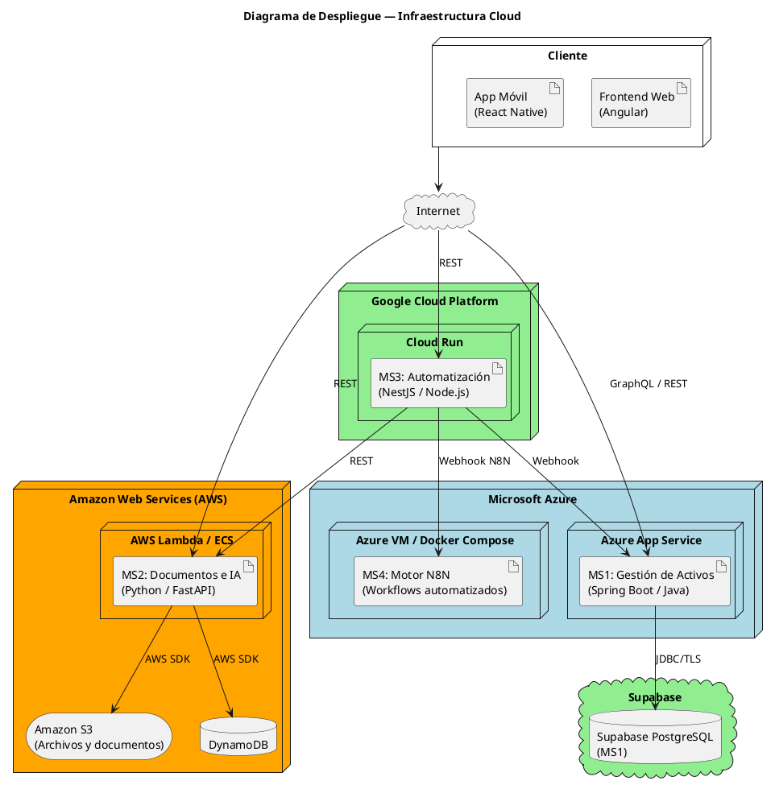

---

## 3. Microservicios

### 3.1 MS1 — Gestión de Activos Fijos

**Lenguaje**: Java / Spring Boot
**Proveedor**: Microsoft Azure
**Base de datos**: Supabase PostgreSQL
**API**: GraphQL (hacia el frontend)

#### Funcionalidades principales

- Registro y catalogación de activos fijos
- Asignación de activos a áreas y responsables
- Registro de traslados y movimientos
- Cálculo automático de depreciación (método lineal y acelerado)
- Registro de bajas de activos
- Reportes e indicadores de Business Intelligence
- Registro blockchain de cada transacción

#### Diagrama de Clases (UML)

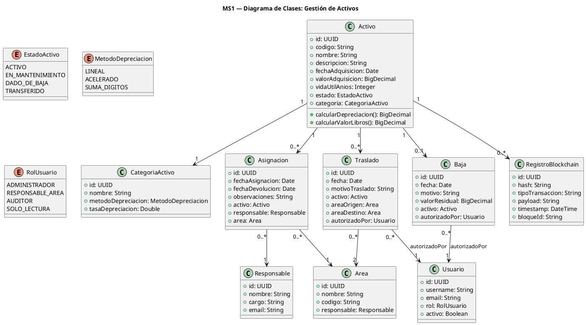

#### Diagrama de Estados — Ciclo de Vida del Activo

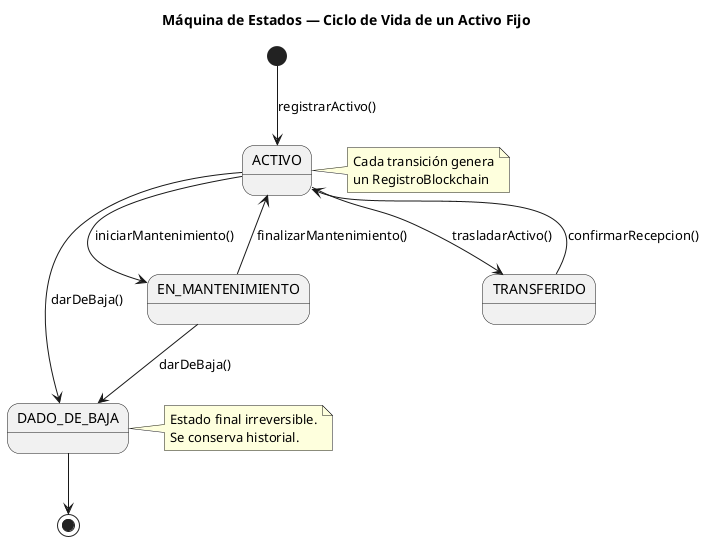

#### Esquema GraphQL (fragmento)

```graphql
type Activo {
  id: ID!
  codigo: String!
  nombre: String!
  valorAdquisicion: Float!
  valorLibros: Float!
  estado: EstadoActivo!
  categoria: CategoriaActivo!
  asignacionActual: Asignacion
  historialTraslados: [Traslado!]!
}

type Query {
  activos(filtro: FiltroActivo): [Activo!]!
  activo(id: ID!): Activo
  reporteDepreciacion(anio: Int!): ReporteDepreciacion!
  dashboardBI: DashboardMetricas!
}

type Mutation {
  registrarActivo(input: ActivoInput!): Activo!
  asignarActivo(activoId: ID!, responsableId: ID!): Asignacion!
  trasladarActivo(activoId: ID!, areaDestinoId: ID!): Traslado!
  darDeBajaActivo(activoId: ID!, motivo: String!): Baja!
}
```

#### Diagrama de Componentes — MS1 (Spring Boot)

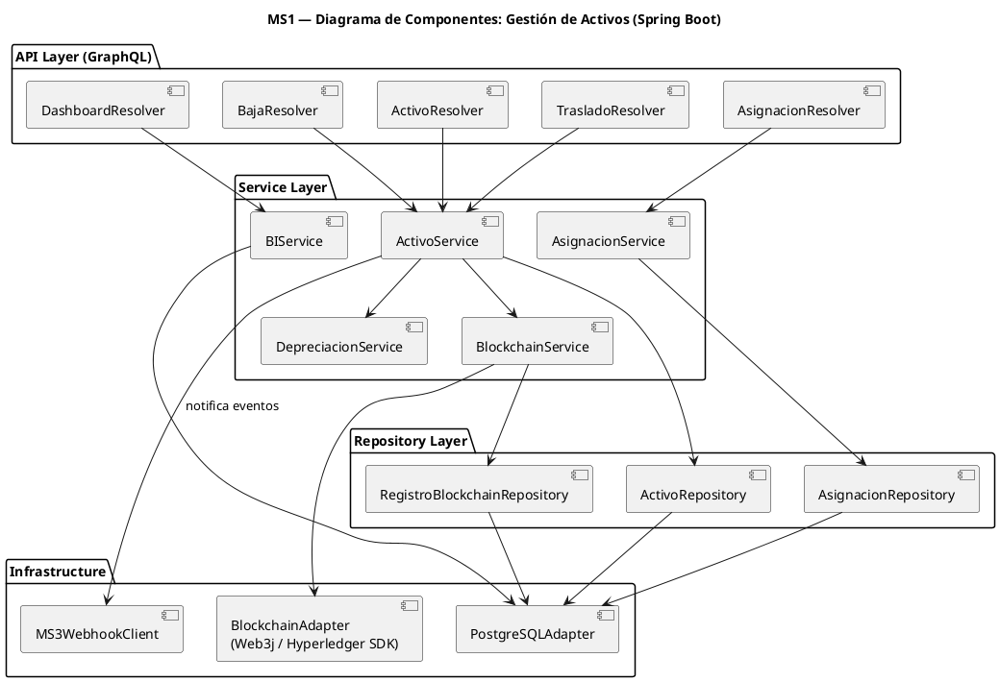

---

### 3.2 MS2 — Gestión Documental e Inteligencia Artificial

**Lenguaje**: Python / FastAPI
**Proveedor**: Amazon Web Services
**Base de datos**: DynamoDB + Amazon S3
**API**: REST

#### Funcionalidades principales

- Subida y descarga de documentos (PDF, imágenes, contratos, facturas)
- Auditoría completa: quién accedió, modificó o visualizó cada documento
- Historial de versiones de documentos
- Deep Learning: verificación visual de evidencia fotográfica del activo
- ML Supervisado: predicción de vida útil restante (Random Forest)
- ML No Supervisado: agrupación de activos por comportamiento (K-Means)

#### Diagrama de Componentes (UML)

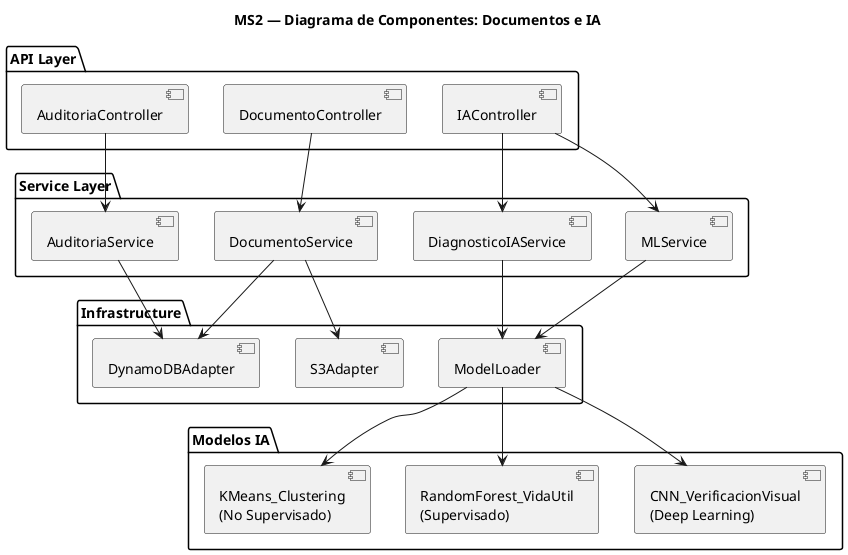

#### Diagrama de Secuencia — Predicción ML

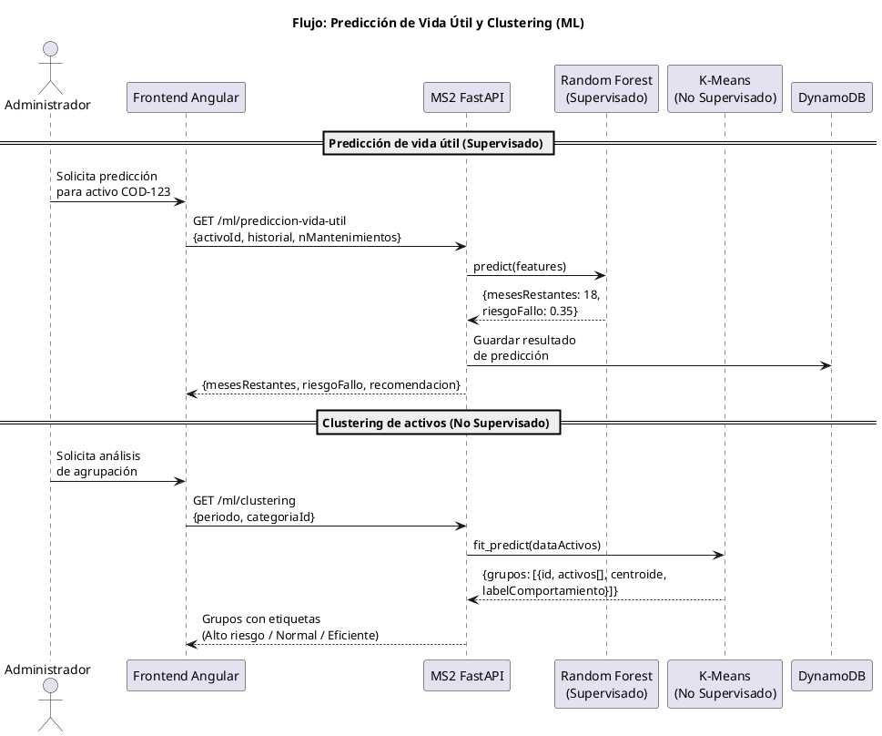

#### Flujo de Verificación Visual de Activo por Imagen

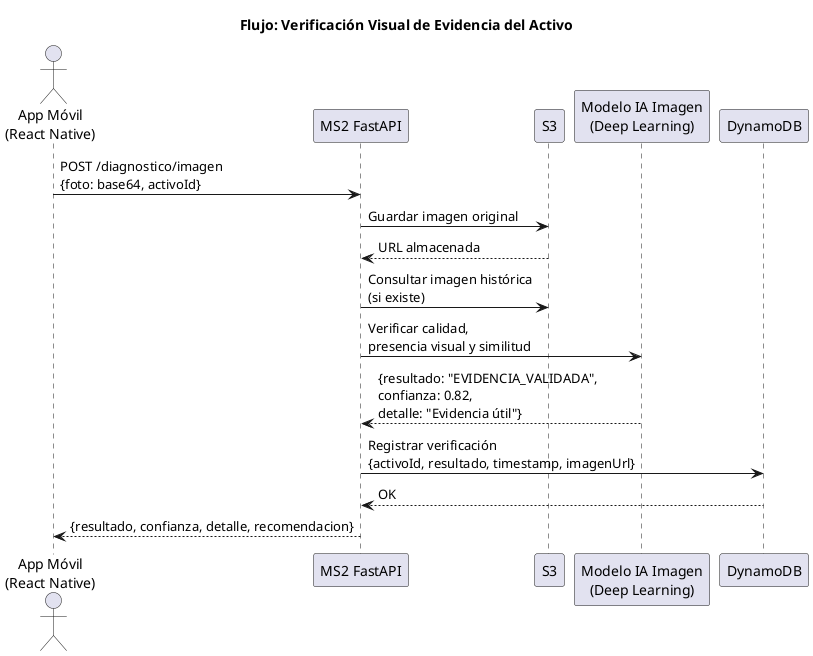

---

### 3.3 MS3 — Automatización y Notificaciones

**Lenguaje**: NestJS (Node.js)
**Proveedor**: Google Cloud Platform
**Motor de automatización**: MS4 — N8N en Azure
**API**: REST / Webhooks

#### Funcionalidades principales

- Recepción y coordinación de eventos de automatización
- Disparo de workflows en MS4/N8N mediante webhook
- Recepción de solicitudes vía WhatsApp
- Generación automática de órdenes de mantenimiento o revisión
- Envío de notificaciones por correo electrónico
- Alertas por vencimiento de garantías o mantenimientos programados
- Regla de seguridad: MS4 solo es consumido por MS3

#### Diagrama de Actividad — Flujo de Automatización

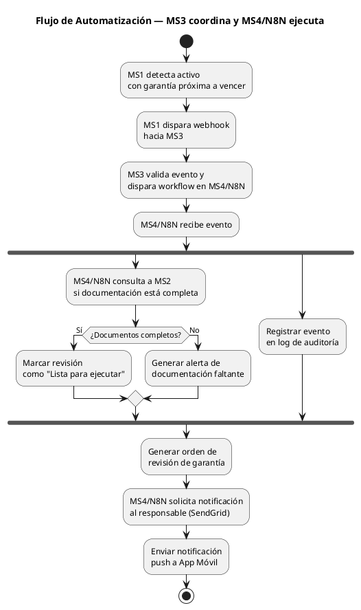

#### Flujo WhatsApp → Sistema

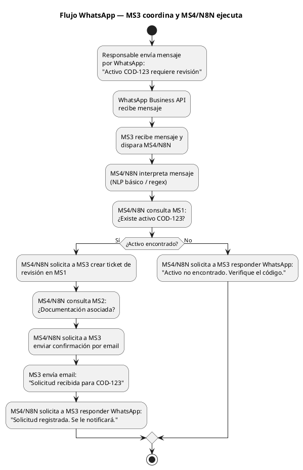

---

### 3.4 MS4 — Motor N8N

**Herramienta**: N8N self-hosted
**Proveedor**: Microsoft Azure
**Persistencia**: Volumen Docker para datos, credenciales y ejecuciones de N8N
**API**: Webhooks N8N consumidos solo por MS3

#### Funcionalidades principales

- Ejecutar workflows exportados y versionados en `ms4/n8n-workflows/`
- Mantener credenciales y configuracion de N8N aisladas de MS3
- Exponer webhooks internos para que MS3 dispare automatizaciones
- Tener CI/CD independiente mediante `.github/workflows/ms4-azure-cd.yml`

#### Restricción de integración

```text
Frontend / Mobile / MS1 / MS2 -> MS3 -> MS4
```

MS4 no forma parte del contrato publico del sistema. Si un flujo debe usar N8N, primero debe llegar a MS3.

## 4. Frontend Web — Angular

### Diagrama de Casos de Uso — Frontend Web

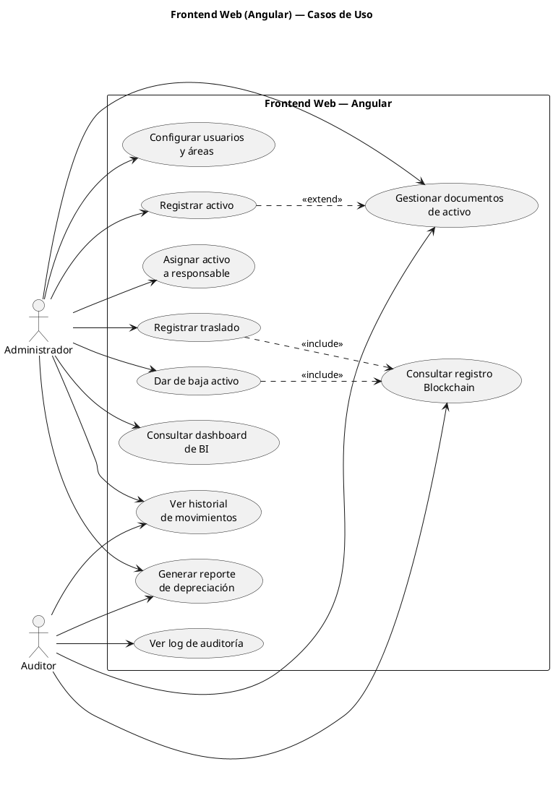

Interfaz web única que consume MS1, MS2 y MS3. La comunicación con MS1 usa exclusivamente **GraphQL**; con MS2 y MS3 usa REST. MS4 no se consume directamente desde el frontend.

### Módulos principales

| Módulo                  | Microservicio | Protocolo |
| ----------------------- | ------------- | --------- |
| Gestión de Activos      | MS1           | GraphQL   |
| Reportes y BI           | MS1           | GraphQL   |
| Gestión Documental      | MS2           | REST      |
| Auditoría               | MS2           | REST      |
| Flujos y Notificaciones | MS3           | REST      |
| Workflows N8N           | MS4           | Solo vía MS3 |

---

## 5. Aplicación Móvil — React Native

La app móvil **no es una réplica** del frontend web. Está orientada al trabajo de campo del responsable de área.

### Recursos del dispositivo utilizados

| Recurso                  | Funcionalidad                                                                 |
| ------------------------ | ----------------------------------------------------------------------------- |
| **Cámara**               | Fotografiar activos para verificación visual de evidencia (Deep Learning)     |
| **GPS**                  | Geolocalizar activos físicamente en mapa; registrar ubicación en inspecciones |
| **Almacenamiento local** | Cache offline de activos asignados al usuario para trabajo sin conexión       |

### Funcionalidad de IA en la app

La app permite tomar una foto de un activo y recibir en tiempo real una verificación visual generada por el MS2. El modelo no emite un estado físico definitivo; valida calidad de la foto, evidencia visual, posible coincidencia con una imagen histórica y genera alertas para revisión humana:

- Estado físico: **Bueno / Deteriorado / Requiere mantenimiento**
- Nivel de confianza del modelo
- Recomendación automática

### Diagrama de Casos de Uso — App Móvil

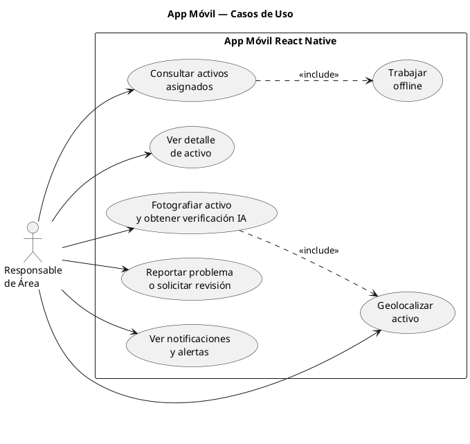

---

## 6. Inteligencia de Negocios (Business Intelligence)

El MS1 expone un endpoint GraphQL `dashboardBI` que alimenta el dashboard del frontend con:

- **KPIs**: total de activos, valor total en libros, activos dados de baja en el período
- **Depreciación acumulada** por categoría y por área
- **Distribución de activos** por estado (activo / en mantenimiento / dado de baja)
- **Proyección de vida útil** de activos críticos
- **Tendencia de adquisiciones** por año

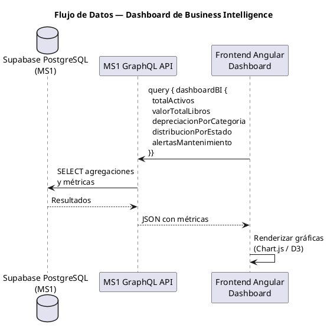

---

## 7. Blockchain

Cada operación crítica sobre un activo genera un registro inmutable en la red blockchain.

### Diagrama de Secuencia — Registro en Blockchain

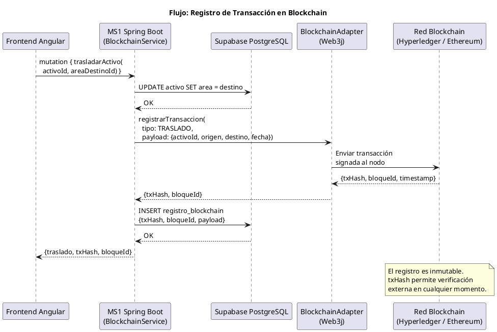

### Eventos registrados

| Evento                | Datos registrados                   |
| --------------------- | ----------------------------------- |
| Adquisición de activo | Código, valor, fecha, proveedor     |
| Asignación            | Activo, responsable, área, fecha    |
| Traslado              | Origen, destino, autorizador, fecha |
| Baja                  | Motivo, valor residual, autorizador |
| Verificación visual crítica | Hash de imagen, resultado IA, fecha |

Esto garantiza trazabilidad completa y no repudio de cada transacción del ciclo de vida del activo.

---

## 8. Machine Learning — Detalle

### 8.1 Aprendizaje Supervisado — Random Forest

**Objetivo**: Predecir la vida útil restante de un activo en función de:

- Edad del activo
- Número de mantenimientos realizados
- Resultados históricos de verificaciones IA
- Categoría y condiciones de uso

**Salida**: Estimado de meses restantes y probabilidad de fallo próximo.

### 8.2 Aprendizaje No Supervisado — K-Means

**Objetivo**: Agrupar activos por patrones de comportamiento para:

- Identificar grupos con alta tasa de mantenimiento
- Detectar activos con comportamiento anómalo
- Optimizar presupuestos de mantenimiento preventivo

---

## 9. Gestión Documental

Implementada en MS2. Cada activo puede tener documentos asociados:

- Factura de compra (PDF)
- Contrato de garantía
- Fotos de estado inicial
- Informes de mantenimiento
- Actas de baja

### Auditoría

DynamoDB almacena un registro por cada acción:

```json
{
  "eventoId": "evt-uuid",
  "documentoId": "doc-uuid",
  "activoId": "act-uuid",
  "accion": "VISUALIZACION | MODIFICACION | DESCARGA | ELIMINACION",
  "usuario": "jperez@empresa.com",
  "timestamp": "2026-06-01T14:30:00Z",
  "ipOrigen": "192.168.1.10",
  "detalles": "Versión anterior: v2 → Nueva versión: v3"
}
```

---

## 10. Resumen de Cumplimiento de Requisitos

| Requisito del Docente          | Solución en el Proyecto                                       |
| ------------------------------ | ------------------------------------------------------------- |
| ≥ 3 microservicios             | MS1 (Activos), MS2 (Docs/IA), MS3 (Automatización), MS4 (N8N) |
| 3 lenguajes distintos          | Java (MS1), Python (MS2), NestJS (MS3)                        |
| 3 proveedores cloud            | Azure (MS1 y MS4), AWS (MS2), Google Cloud (MS3); Supabase como PostgreSQL administrado de MS1 |
| Frontend Angular               | Interfaz web única para MS1, MS2 y MS3                        |
| App móvil React Native         | App de campo para responsables de área                        |
| 3 recursos del dispositivo     | Cámara, GPS, almacenamiento local                             |
| IA en móvil                    | Verificación visual de evidencia del activo por fotografía    |
| Módulo gestión empresarial     | MS1: Sistema completo de activos fijos                        |
| GraphQL obligatorio            | MS1 ↔ Frontend usa exclusivamente GraphQL                     |
| Gestión documental + auditoría | MS2 con DynamoDB + S3 + log de accesos                        |
| Deep Learning                  | Procesamiento de imágenes para validación visual y alertas    |
| ML Supervisado                 | Random Forest: predicción de vida útil                        |
| ML No Supervisado              | K-Means: agrupación por patrones de uso                       |
| Business Intelligence          | Dashboard con KPIs, depreciación, tendencias                  |
| Blockchain                     | Registro inmutable de transacciones de activos                |
| Automatización N8N (≥ 3 pasos) | WhatsApp → MS3 → MS4/N8N → orden/ticket → docs → email/respuesta |
| PostgreSQL                     | MS1: datos principales de activos en Supabase PostgreSQL       |
| DynamoDB                       | MS2: metadatos de documentos y auditoría                      |
| Amazon S3                      | MS2: almacenamiento de archivos físicos                       |
| Despliegue 100% cloud          | Azure + Supabase + AWS + Google Cloud                         |
| Metodología                    | Proceso Unificado                                             |
| Modelado arquitectura          | Modelo C4 (diagramas de contexto y contenedores)              |
| Modelado del sistema           | UML (clases, componentes, casos de uso, secuencia, actividad) |
